---
## Front matter
title: "Лабораторная работа № 3"
subtitle: "Дискреционное разграничение прав в Linux. Два пользователя"
author: "Юрченко Артём Алексеевич"

## Generic otions
lang: ru-RU
toc-title: "Содержание"

## Bibliography
bibliography: bib/cite.bib
csl: pandoc/csl/gost-r-7-0-5-2008-numeric.csl

## Pdf output format
toc: true # Table of contents
toc-depth: 2
lof: true # List of figures
lot: true # List of tables
fontsize: 12pt
linestretch: 1.5
papersize: a4
documentclass: scrreprt
## I18n polyglossia
polyglossia-lang:
  name: russian
  options:
	- spelling=modern
	- babelshorthands=true
polyglossia-otherlangs:
  name: english
## I18n babel
babel-lang: russian
babel-otherlangs: english
## Fonts
mainfont: PT Serif
romanfont: PT Serif
sansfont: PT Sans
monofont: PT Mono
mainfontoptions: Ligatures=TeX
romanfontoptions: Ligatures=TeX
sansfontoptions: Ligatures=TeX,Scale=MatchLowercase
monofontoptions: Scale=MatchLowercase,Scale=0.9
## Biblatex
biblatex: true
biblio-style: "gost-numeric"
biblatexoptions:
  - parentracker=true
  - backend=biber
  - hyperref=auto
  - language=auto
  - autolang=other*
  - citestyle=gost-numeric
## Pandoc-crossref LaTeX customization
figureTitle: "Рис."
tableTitle: "Таблица"
listingTitle: "Листинг"
lofTitle: "Список иллюстраций"
lotTitle: "Список таблиц"
lolTitle: "Листинги"
## Misc options
indent: true
header-includes:
  - \usepackage{indentfirst}
  - \usepackage{float} # keep figures where there are in the text
  - \floatplacement{figure}{H} # keep figures where there are in the text
---

# Цель работы

Целью данной работы является получение практических навыков работы в консоли с атрибутами файлов для групп пользователей.

---
# Выполнение лабораторной работы

1. Неободимости создавать запись guest нет, так как она уже была создана во время выполнения предыдущей лаборатоной работы. Создадим учетную запись пользователя guest2 и зададим пароль (@fig:001).

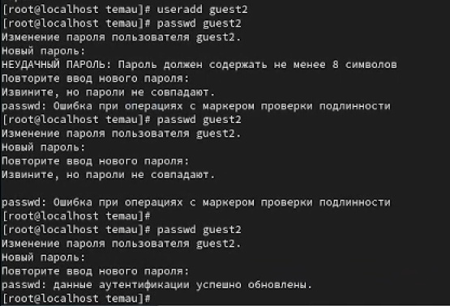{#fig:001 width=90%}

2. Добавим пользователя guest2 в группу guest (@fig:002).

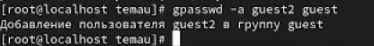{#fig:002 width=90%}

3. Осуществим вход в систему от двух пользователей на двух разных консолях (@fig:003).

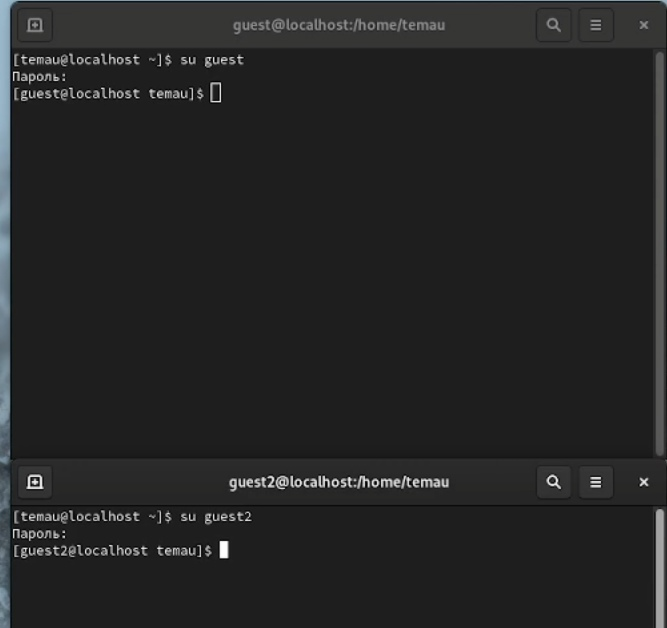{#fig:003 width=90%}

4. Для обоих пользователей командой pwd определим директорию, в которой мы находимся. Видим, что приглашение в командной строке соответствует (@fig:004 - @fig:005).

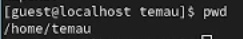{#fig:004 width=90%}

{#fig:005 width=90%}

5. Уточним имя пользователя, его группу, кто входит в неё и к каким группам принадлежит он сам (@fig:006 - @fig:007).

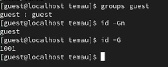{#fig:006 width=90%}

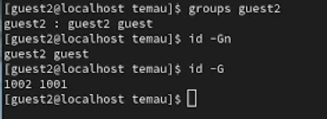{#fig:007 width=90%}

Заметим, что все команды выводят одинаковую информацию, но в разных форматах

6. Сравним полученную информацию с содержимым файла /etc/group (@fig:008)

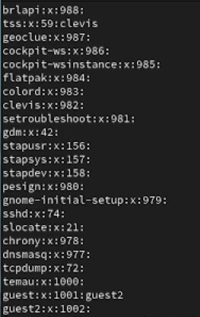{#fig:008 width=90%}

Видим информацию о группе, ее id и название подгруппы.

7. От имени пользователя guest2 выполним регистрацию пользователя guest2 в группе guest (@fig:009)

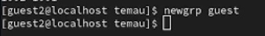{#fig:009 width=90%}

8. От имени пользователя guest изменим права директории /home/guest, разрешив все действия для пользователей группы (@fig:010)

{#fig:010 width=90%}

9. От имени пользователя guest снимем с директории /home/guest/dir1 все атрибуты (@fig:011)

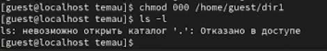{#fig:011 width=90%}

10. Заполним таблицу «Установленные права и разрешённые действия» (@fig:012).

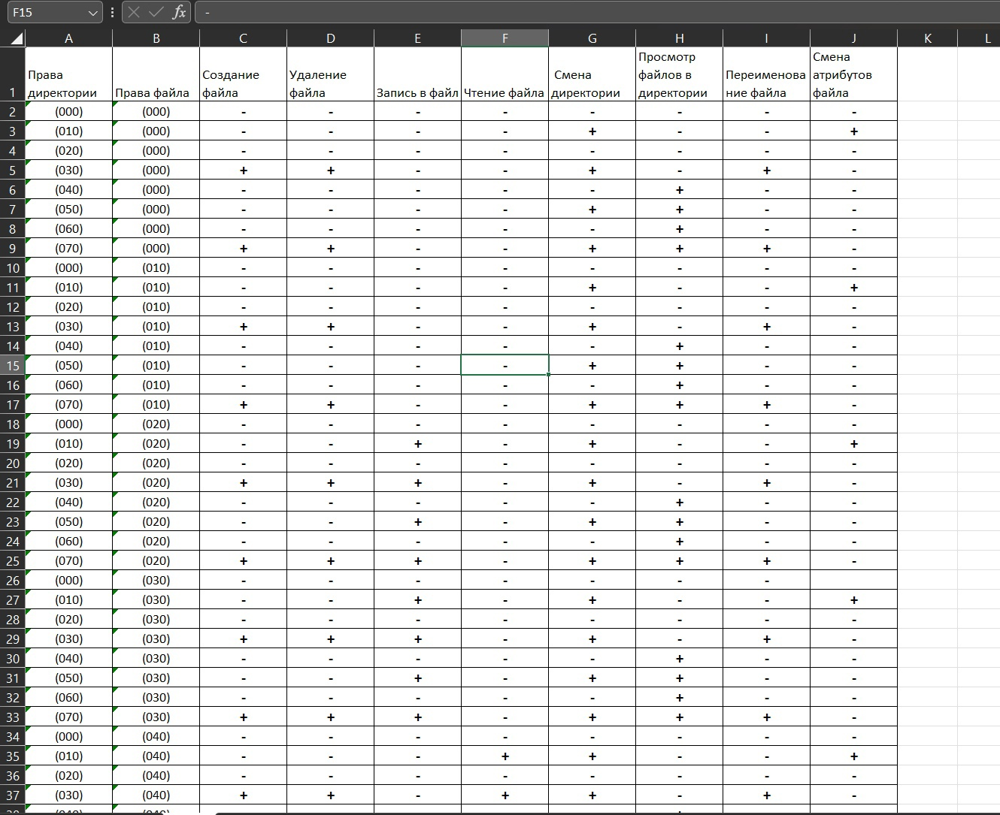{#fig:012 width=90%}

11. Заполним таблицу «Минимальные права для совершения операций» (@fig:013).

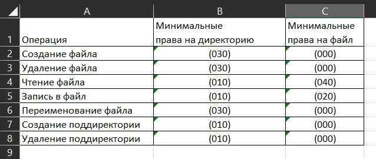{#fig:013 width=90%}

# Выводы

В рамках данной лабораторной работы были получены практические навыки работы в консоли с атрибутами файлов для групп пользователей.

# Список литературы{.unnumbered}

[1] https://blog.skillfactory.ru/glossary/operaczionnaya-sistema/

[2] https://codechick.io/tutorials/unix-linux/unix-linux-permissions
