---
## Front matter
lang: ru-RU
title: Лабораторная работа № 4
author:
  - Юрченко Артём Алексеевич
group:
  - НФИбд-02-20, 1032201660
date: 2023, Москва

## i18n babel
babel-lang: russian
babel-otherlangs: english

## Fonts
mainfont: PT Serif
romanfont: PT Serif
sansfont: PT Sans
monofont: PT Mono
mainfontoptions: Ligatures=TeX
romanfontoptions: Ligatures=TeX
sansfontoptions: Ligatures=TeX,Scale=MatchLowercase
monofontoptions: Scale=MatchLowercase,Scale=0.9

## Formatting pdf
toc: false
toc-title: Содержание
slide_level: 2
aspectratio: 169
section-titles: true
theme: metropolis
header-includes:
 - \metroset{progressbar=frametitle,sectionpage=progressbar,numbering=fraction}
 - '\makeatletter'
 - '\beamer@ignorenonframefalse'
 - '\makeatother'
---

## Цели

Целью данной работы является получение практических навыков работы в консоли с расширенными атрибутами файлов.

## Задачи

1. Исследовать доступность команд при установленном расширенном aтрибуте a.

2. Исследовать доступность команд при установленном расширенном aтрибуте i.

## Ход работы

От имени пользователя guest определим расширенные атрибуты файла /home/guest/dir1/file1.

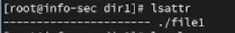{#fig:001 width=90%}

## Ход работы

Установим командой на файл file1 права, разрешающие чтение и запись для владельца файла.

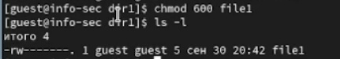{#fig:002 width=90%}

## Ход работы

Попробуем установить на файл /home/guest/dir1/file1 расширенный атрибут a от имени пользователя guest.

{#fig:003 width=90%}

## Ход работы

Откроем еще одну консоль с правами администратора. Установим на файл /home/guest/dir1/file1 расширенный атрибут a.

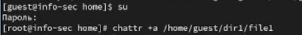{#fig:004 width=90%}

## Ход работы

От пользователя guest проверим правильность установления атрибута.

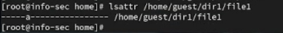{#fig:005 width=90%}

## Ход работы

Выполним дозапись в файл file1 слова «test» и выполним чтение файла file1.

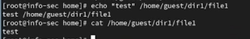{#fig:006 width=90%}

## Ход работы

Попробуем стереть имеющуюся в файле информацию и переименовать его.

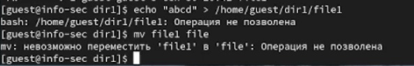{#fig:007 width=90%}

## Ход работы

Попробуем установить на файл file1 права, запрещающие чтение и запись для владельца файла. Этого сделать не удалось.

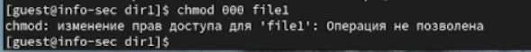{#fig:008 width=90%}

## Ход работы

Снимем расширенный атрибут a с файла /home/guest/dirl/file1 от
имени суперпользователя.

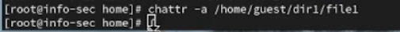{#fig:009 width=90%}

## Ход работы

Повторим операции, которые нам ранее не удавалось выполнить. Теперь все операции выполняются.

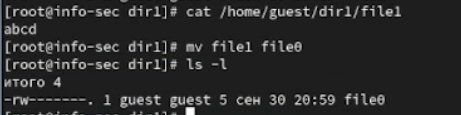{#fig:010 width=90%}

## Ход работы

Повторим действия по шагам, заменив атрибут «a» атрибутом «i».

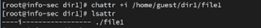{#fig:011 width=60%}

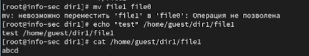{#fig:012 width=60%}

Дозаписать информацию в файл не удалось

## Ход работы

Снимаем атрибут i с файла.
3
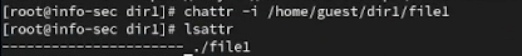{#fig:013 width=90%}

## Результаты

В рамках данной лабораторной работы были получены практические навыки работы в консоли с расширенными атрибутами файлов.
