---
## Front matter
title: "Лабораторная работа № 6"
subtitle: "Мандатное разграничение прав в Linux"
author: "Юрченко Артём Алексеевич"

## Generic otions
lang: ru-RU
toc-title: "Содержание"

## Bibliography
bibliography: bib/cite.bib
csl: pandoc/csl/gost-r-7-0-5-2008-numeric.csl

## Pdf output format
toc: true # Table of contents
toc-depth: 2
lof: true # List of figures
lot: false
fontsize: 12pt
linestretch: 1.5
papersize: a4
documentclass: scrreprt
## I18n polyglossia
polyglossia-lang:
  name: russian
  options:
	- spelling=modern
	- babelshorthands=true
polyglossia-otherlangs:
  name: english
## I18n babel
babel-lang: russian
babel-otherlangs: english
## Fonts
mainfont: PT Serif
romanfont: PT Serif
sansfont: PT Sans
monofont: PT Mono
mainfontoptions: Ligatures=TeX
romanfontoptions: Ligatures=TeX
sansfontoptions: Ligatures=TeX,Scale=MatchLowercase
monofontoptions: Scale=MatchLowercase,Scale=0.9
## Biblatex
biblatex: true
biblio-style: "gost-numeric"
biblatexoptions:
  - parentracker=true
  - backend=biber
  - hyperref=auto
  - language=auto
  - autolang=other*
  - citestyle=gost-numeric
## Pandoc-crossref LaTeX customization
figureTitle: "Рис."
tableTitle: "Таблица"
listingTitle: "Листинг"
lofTitle: "Список иллюстраций"
lotTitle: "Список таблиц"
lolTitle: "Листинги"
## Misc options
indent: true
header-includes:
  - \usepackage{indentfirst}
  - \usepackage{float} # keep figures where there are in the text
  - \floatplacement{figure}{H} # keep figures where there are in the text
---

## Цели

Развить навыки администрирования ОС Linux. Получить первое практическое знакомство с технологией SELinux1. Проверить работу SELinx на практике совместно с веб-сервером
Apache.

## Задачи

1. Настроить и запустить сервер Apache.

2. Исследовать влияние параметров сервера на его работу.

## Ход работы

Войдем в систему с полученными учётными данными и убедимся, что
SELinux работает в режиме enforcing политики targeted.

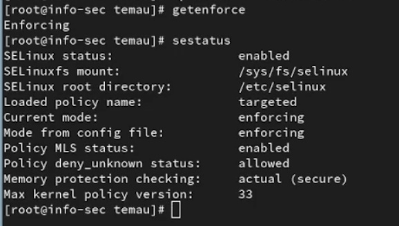{#fig:001 width=60%}

## Ход работы

Обратимся с помощью браузера к веб-серверу, запущенному на нашем
компьютере, и убедимся, что последний работает.

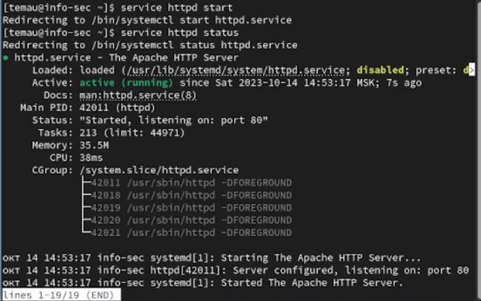{#fig:002 width=60%}

## Ход работы

Найдем веб-сервер Apache в списке процессов, определим его контекст
безопасности.

{#fig:003 width=90%}

## Ход работы

Посмотрим текущее состояние переключателей SELinux для Apache.

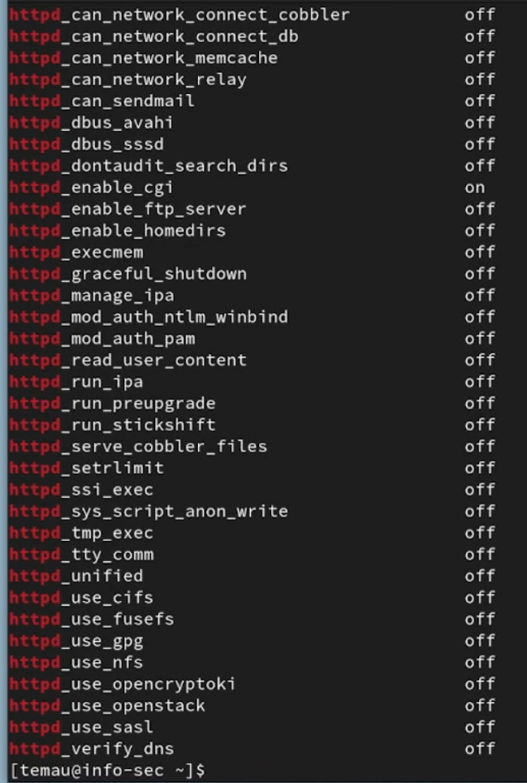{#fig:004 width=30%}

## Ход работы

Посмотрим статистику по политике с помощью команды seinfo.

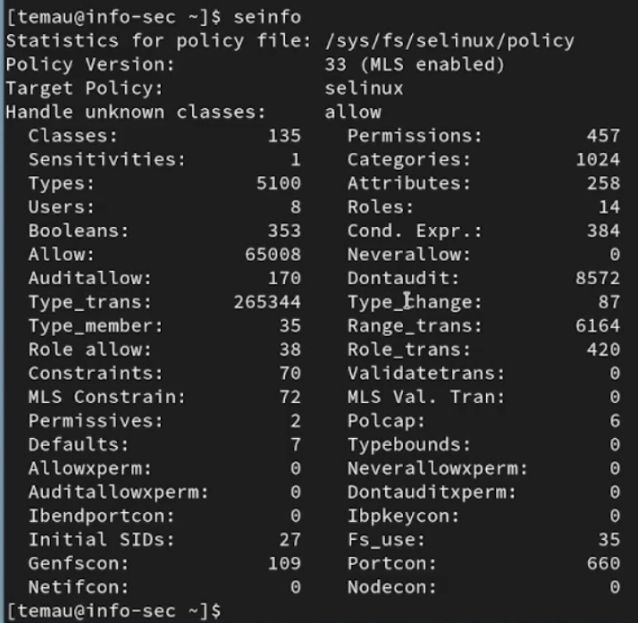{#fig:005 width=30%}

## Ход работы

Определим тип файлов и поддиректорий, находящихся в директории
/var/www.

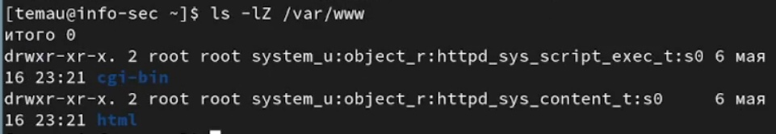{#fig:006 width=90%}

## Ход работы

Определим тип файлов, находящихся в директории /var/www/html.

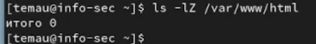{#fig:007 width=90%}

## Ход работы

Определим круг пользователей, которым разрешено создание файлов в
директории /var/www/html.

{#fig:008 width=90%}

## Ход работы

Создадим от имени суперпользователя html-файл /var/www/html/test.html.

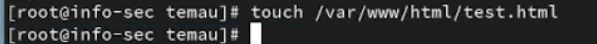{#fig:009 width=90%}

Заполним его следующим содержимым:

	<html>
	<body>test</body>
	</html>

## Ход работы

Проверим контекст созданного нами файла.

{#fig:010 width=90%}

Как видим по умолчанию присваивается контекст unconfined_u:object_r:httpd_sys_content_t:s0

## Ход работы

Обратимся к файлу через веб-сервер, введя в браузере адрес
http://127.0.0.1/test.html. Убедимся, что файл был успешно отображён.

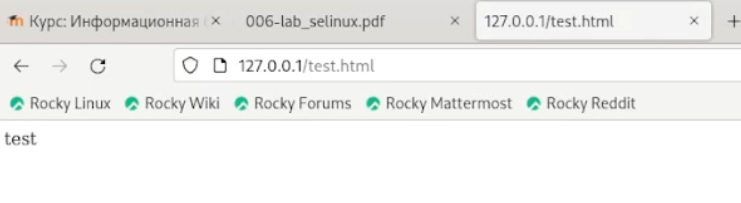{#fig:011 width=90%}

## Ход работы

Изучим справку man httpd_selinux и выясним, какие контексты файлов определены для httpd. Сопоставим их с типом файла test.html.

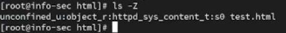{#fig:012 width=90%}

## Ход работы

Изменим контекст файла /var/www/html/test.html с httpd_sys_content_t на samba_share_t.

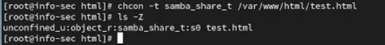{#fig:013 width=90%}

## Ход работы

Попробуем ещё раз получить доступ к файлу через веб-сервер.

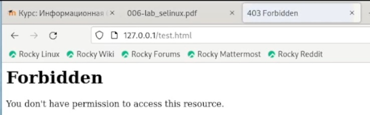{#fig:014 width=90%}

## Ход работы

Просмотрим log-файлы веб-сервера Apache и системный лог-файл.

{#fig:015 width=60%}

Как видим, нам не удалось получить доступ к файлу как раз из-за измененного контекста.

## Ход работы

Попробуем запустить веб-сервер Apache на прослушивание ТСР-порта 81.

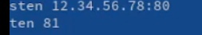{#fig:016 width=90%}

## Ход работы

Выполним перезапуск веб-сервера. Сбоя не произошло.

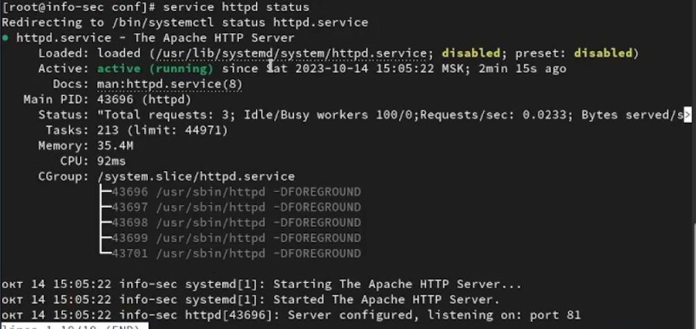{#fig:017 width=60%}

## Ход работы

Проанализируем лог-файлы.

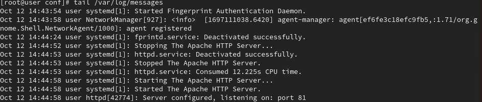{#fig:018 width=90%}

## Ход работы

Выполним команду semanage port -a -t http_port_t -р tcp 81. После этого проверим список портов командой semanage port -l | grep http_port_t
Убедимся, что порт 81 есть в списке.

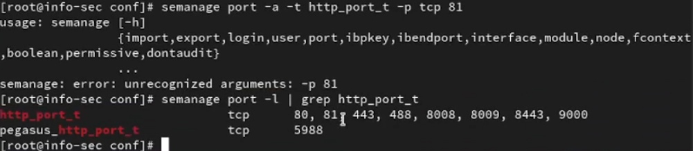{#fig:019 width=90%}

## Ход работы

Попробуем запустить веб-сервер Apache ещё раз.

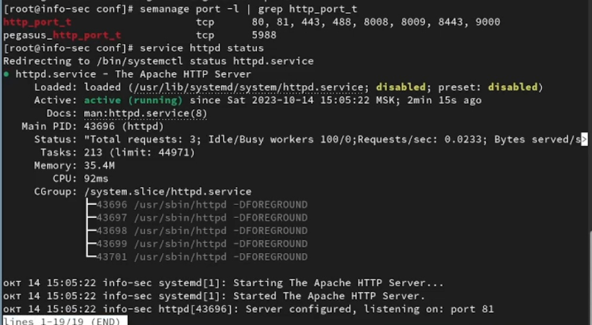{#fig:020 width=90%}

## Ход работы

Вернем контекст httpd_sys_cоntent__t к файлу /var/www/html/ test.html. Попробуем получить доступ к файлу через веб-сервер.

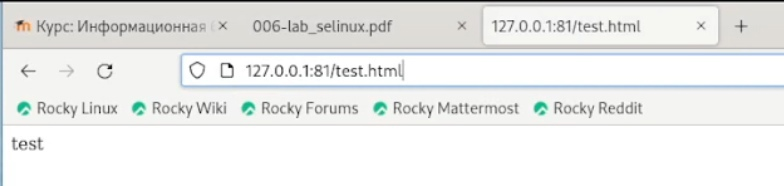{#fig:021 width=90%}

## Ход работы

Исправим обратно конфигурационный файл apache, вернув Listen 80.

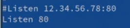{#fig:022 width=90%}

## Ход работы

Попробуем удалить привязку http_port_t к 81. Удаление невозможно.

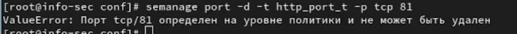{#fig:023 width=90%}

## Ход работы

Удалим файл /var/www/html/test.html.

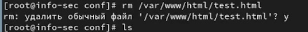{#fig:024 width=90%}

## Результаты

В рамках данной лабораторной работы были развиты навыки администрирования ОС Linux. Получено первое практическое знакомство с технологией SELinux1. Проверена работа SELinx на практике совместно с веб-сервером Apache.
