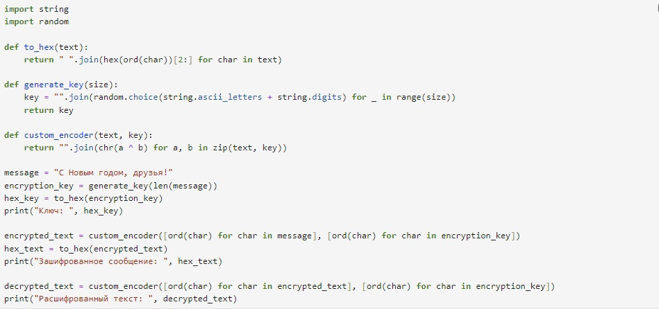
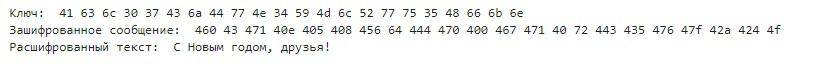

---
## Front matter
lang: ru-RU
title: Лабораторная работа № 7
author:
  - Юрченко Артём Алексеевич
group:
  - НФИбд-02-20, 1032201660
date: 2023, Москва

## i18n babel
babel-lang: russian
babel-otherlangs: english

## Fonts
mainfont: PT Serif
romanfont: PT Serif
sansfont: PT Sans
monofont: PT Mono
mainfontoptions: Ligatures=TeX
romanfontoptions: Ligatures=TeX
sansfontoptions: Ligatures=TeX,Scale=MatchLowercase
monofontoptions: Scale=MatchLowercase,Scale=0.9

## Formatting pdf
toc: false
toc-title: Содержание
slide_level: 2
aspectratio: 169
section-titles: true
theme: metropolis
header-includes:
 - \metroset{progressbar=frametitle,sectionpage=progressbar,numbering=fraction}
 - '\makeatletter'
 - '\beamer@ignorenonframefalse'
 - '\makeatother'
---

## Цели

Освоить на практике применение режима однократного гаммирования.

## Задание

Нужно подобрать ключ, чтобы получить сообщение «С Новым Годом,
друзья!». Требуется разработать приложение, позволяющее шифровать и
дешифровать данные в режиме однократного гаммирования. Приложение
должно:

1. Определить вид шифротекста при известном ключе и известном открытом тексте.
2. Определить ключ, с помощью которого шифротекст может быть преобразован в некоторый фрагмент текста, представляющий собой один из возможных вариантов прочтения открытого текста.

## Теоретическое введение 

Гаммирование – это наложение (снятие) на открытые (зашифрованные) данные криптографической гаммы, т.е. последовательности элементов данных, вырабатываемых с помощью некоторого криптографического алгоритма, для получения зашифрованных (открытых) данных.

## Теоретическое введение 

Наложение (или снятие) гаммы на блок сообщения в рассматриваемом нами стандарте реализуется с помощью операции побитного сложения по модулю 2 (XOR). То есть при шифровании сообщений каждый блок открытого сообщения ксорится с блоком криптографической гаммы, длина которого должна соответствовать длине блоков открытого сообщения. При этом, если размер блока исходного текста меньше, чем размер блока гаммы, блок гаммы обрезается до размера блока исходного текста (выполняется процедура усечения гаммы).

# Выполнение лабораторной работы

## Код программы на языке python

{ #fig:001 width=70% height=70%}

## Пример работы программы

{ #fig:002 width=70% height=70%}

# Выводы

## Результаты выполнения лабораторной работы

Изучили алгоритм шифрования с помощью гаммирования