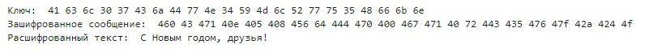

---
## Front matter
title: "Лабораторная работа № 7"
subtitle: "Элементы криптографии. Однократное гаммирование."
author: "Юрченко Артём Алексеевич"

## Generic otions
lang: ru-RU
toc-title: "Содержание"

## Bibliography
bibliography: bib/cite.bib
csl: pandoc/csl/gost-r-7-0-5-2008-numeric.csl

## Pdf output format
toc: true # Table of contents
toc-depth: 2
lof: true # List of figures
lot: false
fontsize: 12pt
linestretch: 1.5
papersize: a4
documentclass: scrreprt
## I18n polyglossia
polyglossia-lang:
  name: russian
  options:
	- spelling=modern
	- babelshorthands=true
polyglossia-otherlangs:
  name: english
## I18n babel
babel-lang: russian
babel-otherlangs: english
## Fonts
mainfont: PT Serif
romanfont: PT Serif
sansfont: PT Sans
monofont: PT Mono
mainfontoptions: Ligatures=TeX
romanfontoptions: Ligatures=TeX
sansfontoptions: Ligatures=TeX,Scale=MatchLowercase
monofontoptions: Scale=MatchLowercase,Scale=0.9
## Biblatex
biblatex: true
biblio-style: "gost-numeric"
biblatexoptions:
  - parentracker=true
  - backend=biber
  - hyperref=auto
  - language=auto
  - autolang=other*
  - citestyle=gost-numeric
## Pandoc-crossref LaTeX customization
figureTitle: "Рис."
tableTitle: "Таблица"
listingTitle: "Листинг"
lofTitle: "Список иллюстраций"
lotTitle: "Список таблиц"
lolTitle: "Листинги"
## Misc options
indent: true
header-includes:
  - \usepackage{indentfirst}
  - \usepackage{float} # keep figures where there are in the text
  - \floatplacement{figure}{H} # keep figures where there are in the text
---

# Цель работы

Освоить на практике применение режима однократного гаммирования.

# Задание

Нужно подобрать ключ, чтобы получить сообщение «С Новым Годом,
друзья!». Требуется разработать приложение, позволяющее шифровать и
дешифровать данные в режиме однократного гаммирования. Приложение
должно:

1. Определить вид шифротекста при известном ключе и известном открытом тексте.
2. Определить ключ, с помощью которого шифротекст может быть преобразован в некоторый фрагмент текста, представляющий собой один из
возможных вариантов прочтения открытого текста.

# Теоретические сведения

## Шифр гаммирования

Гаммирование – это наложение (снятие) на открытые (зашифрованные) данные криптографической гаммы, т.е. последовательности элементов данных, вырабатываемых с помощью некоторого криптографического алгоритма, для получения зашифрованных (открытых) данных.

Принцип шифрования гаммированием заключается в генерации гаммы шифра с помощью датчика псевдослучайных чисел и наложении полученной гаммы шифра на открытые данные обратимым образом (например, используя операцию сложения по модулю 2). Процесс дешифрования сводится к повторной генерации гаммы шифра при известном ключе и наложении такой же гаммы на зашифрованные данные.
Полученный зашифрованный текст является достаточно трудным для раскрытия в том случае, если гамма шифра не содержит повторяющихся битовых последовательностей и изменяется случайным образом для каждого шифруемого слова. Если период гаммы превышает длину всего зашифрованного текста и неизвестна никакая часть исходного текста, то шифр можно раскрыть только прямым перебором (подбором ключа). В этом случае криптостойкость определяется размером ключа.

Метод гаммирования становится бессильным, если известен фрагмент исходного текста и соответствующая ему шифрограмма. В этом случае простым вычитанием по модулю 2 получается отрезок псевдослучайной последовательности и по нему восстанавливается вся эта последовательность.

Метод гаммирования с обратной связью заключается в том, что для получения сегмента гаммы используется контрольная сумма определенного участка шифруемых данных. Например, если рассматривать гамму шифра как объединение непересекающихся множеств H(j), то процесс шифрования можно пердставить следующими шагами:

1. Генерация сегмента гаммы H(1) и наложение его на соответствующий участок шифруемых данных.

2. Подсчет контрольной суммы участка, соответствующего сегменту гаммы H(1).

3. Генерация с учетом контрольной суммы уже зашифрованного участка данных следующего сегмента гамм H(2).

4. Подсчет контрольной суммы участка данных, соответствующего сегменту данных H(2) и т.д.

# Выполнение лабораторной работы

## Реализация шифратора и дешифратора Python

```
import string
import random

def to_hex(text):
    return " ".join(hex(ord(char))[2:] for char in text)

def generate_key(size):
    key = "".join(random.choice(string.ascii_letters + string.digits) for _ in range(size))
    return key

def custom_encoder(text, key):
    return "".join(chr(a ^ b) for a, b in zip(text, key))

message = "С Новым годом, друзья!"
encryption_key = generate_key(len(message))
hex_key = to_hex(encryption_key)
print("Ключ: ", hex_key)

encrypted_text = custom_encoder([ord(char) for char in message], [ord(char) for char in encryption_key])
hex_text = to_hex(encrypted_text)
print("Зашифрованное сообщение: ", hex_text)

decrypted_text = custom_encoder([ord(char) for char in encrypted_text], [ord(char) for char in encryption_key])
print("Расшифрованный текст: ", decrypted_text)

```

## Контрольный пример (рис. @fig:001)

{ #fig:001 width=70% height=70%}

# Выводы

В рамках данной лабораторной работы было освоено на практике применение режима однократного гаммирования.

# Список литературы{.unnumbered}

[1] https://www.kaspersky.ru/resource-center/definitions/encryption

[2] https://xakep.ru/2019/07/18/crypto-xor/
