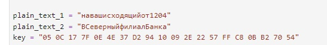
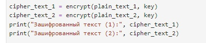
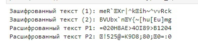

---
## Front matter
lang: ru-RU
title: Лабораторная работа № 8
author:
  - Юрченко Артём Алексеевич
group:
  - НФИбд-02-20, 1032201660
date: 2023, Москва

## i18n babel
babel-lang: russian
babel-otherlangs: english

## Fonts
mainfont: PT Serif
romanfont: PT Serif
sansfont: PT Sans
monofont: PT Mono
mainfontoptions: Ligatures=TeX
romanfontoptions: Ligatures=TeX
sansfontoptions: Ligatures=TeX,Scale=MatchLowercase
monofontoptions: Scale=MatchLowercase,Scale=0.9

## Formatting pdf
toc: false
toc-title: Содержание
slide_level: 2
aspectratio: 169
section-titles: true
theme: metropolis
header-includes:
 - \metroset{progressbar=frametitle,sectionpage=progressbar,numbering=fraction}
 - '\makeatletter'
 - '\beamer@ignorenonframefalse'
 - '\makeatother'
---

## Цели

Освоить на практике применение режима однократного гаммирования
на примере кодирования различных исходных текстов одним ключом.

## Задачи

Два текста кодируются одним ключом (однократное гаммирование).
Требуется не зная ключа и не стремясь его определить, прочитать оба текста. Необходимо разработать приложение, позволяющее шифровать и дешифровать тексты P1 и P2 в режиме однократного гаммирования. Приложение должно определить вид шифротекстов C1 и C2 обоих текстов P1 и P2 при известном ключе ; Необходимо определить и выразить аналитически способ, при котором злоумышленник может прочитать оба текста, не зная ключа и не стремясь его определить.

## Ход работы

Создаем функцию шифрования.

{#fig:001 width=90%}

## Ход работы

Введем данные из условия.

{#fig:002 width=90%}

## Ход работы

Зашифруем текст с помощью ключа К.

{#fig:003 width=90%}

## Ход работы

Создадим последовательность, с помощью которой будем расшифровывать текст. Передадим ее в функцию шифрования вместе с зашифрованным текстом.

{#fig:004 width=90%}

## Ход работы

Запустим программу и получим результат.

{#fig:005 width=90%}

## Результаты

В рамках данной лабораторной работы было освоено на практике применение режима однократного гаммирования на примере кодирования различных исходных текстов одним ключом.
